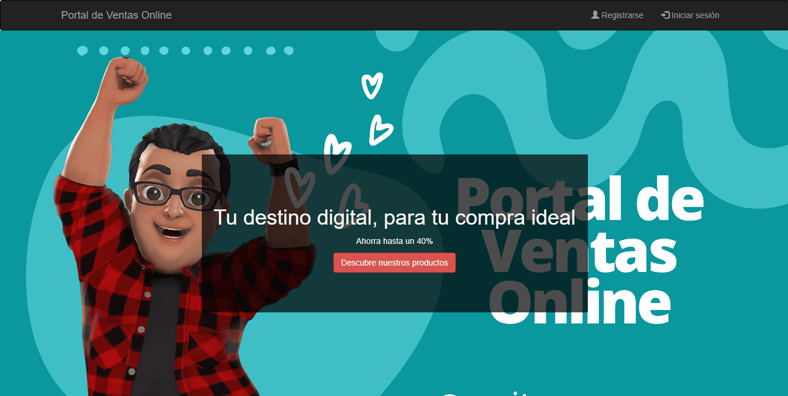
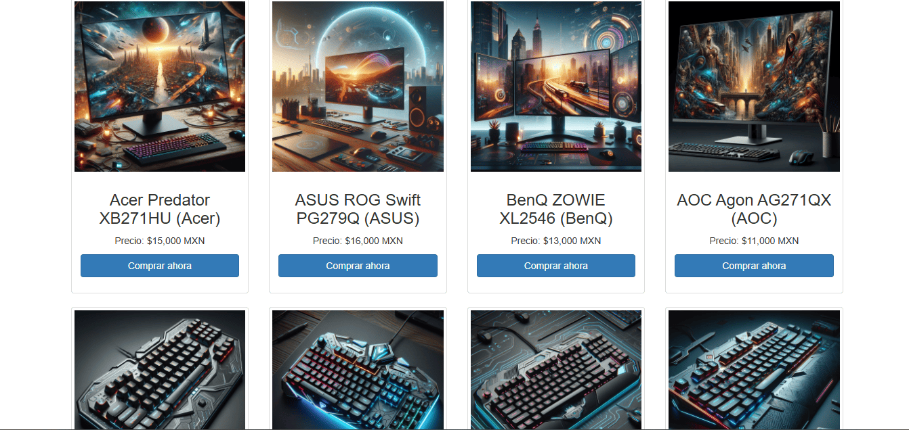
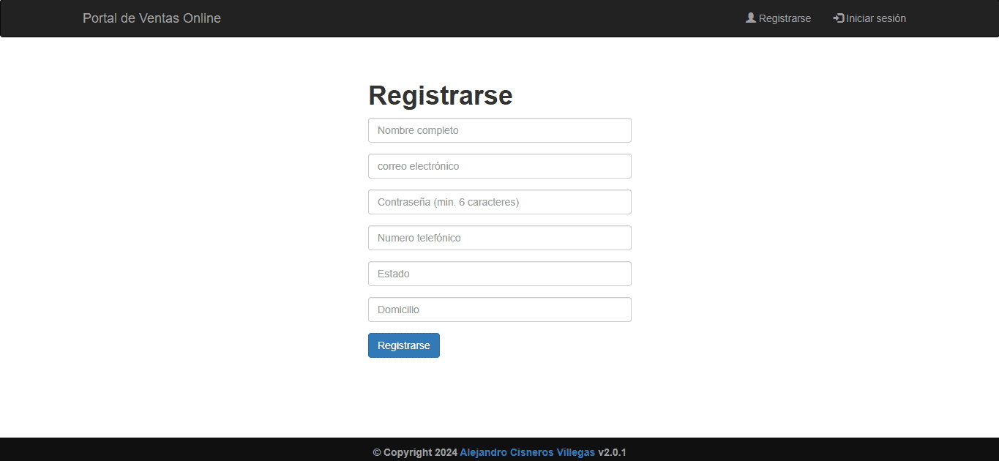
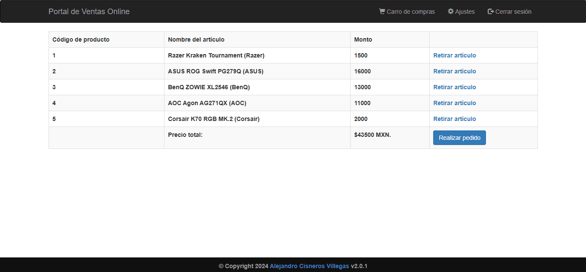

# Portal de ventas online

El **Portal de Ventas Online** es una plataforma digital diseñada para ofrecer una experiencia de compra sencilla y segura a los usuarios interesados en adquirir productos electrónicos. Desde audífonos de alta fidelidad hasta pantallas de escritorio para PC y teclados especializados para gaming, nuestra plataforma ofrece una amplia variedad de productos de calidad para satisfacer las necesidades de nuestros clientes.

<p align="center">
  
</p>

Con una interfaz intuitiva y fácil de usar, los usuarios pueden explorar nuestro catálogo de productos, cada uno acompañado de imágenes detalladas, descripciones completas y precios transparentes. El proceso de compra es rápido y sencillo, permitiendo a los usuarios agregar productos a su carrito de compras y realizar pagos de forma segura.

<p align="center">
  
</p>

Los usuarios tienen la opción de registrarse en nuestro portal para disfrutar de funciones adicionales, como el seguimiento de pedidos y la gestión de la información personal. Nuestro compromiso con la seguridad se refleja en la implementación de medidas para proteger la información financiera y personal de nuestros clientes en todo momento.

<p align="center">
  
</p>

El desarrollo del Portal de Ventas Online se basa en tecnologías web modernas, como **HTML**, **CSS**, **JavaScript** y **PHP** para el backend. Además, utilizamos la base de datos relacional **MySQL** para almacenar y gestionar la información de productos, usuarios y pedidos. Priorizamos la seguridad y la experiencia del usuario en cada etapa del proceso de desarrollo.

<p align="center">
  
</p>

En resumen, el Portal de Ventas Online es una solución digital que ofrece una experiencia de compra conveniente y confiable para los entusiastas de la tecnología. Con una amplia selección de productos electrónicos y una plataforma fácil de usar, estamos comprometidos a proporcionar a nuestros clientes una experiencia de compra en línea excepcional.

**Consulta la versión preliminar del proyecto aquí:** [https://portal-de-ventas-online.com](https://www.alejandrovillegas.net/projects/project-04/index.php)

# 📌 Información del Proyecto

Este proyecto ha sido desarrollado como parte del portafolio de soluciones tecnológicas, con el objetivo de ofrecer una herramienta eficiente y funcional para usuarios autodidactas interesados en la gestión y desarrollo de proyectos web.

- **Área**: Desarrollo de Proyectos Web

- **Usuario Final**: Autodidactas y Desarrolladores

- **Fecha de Desarrollo**: 05 de marzo de 2024

- **Portafolio de Proyectos**: [www.alejandrovillegas.net](https://www.alejandrovillegas.net/)

# Guía de Instalación y Configuración del Proyecto

## 🖥️ Requisitos del Sistema

Para ejecutar este proyecto de manera local, es necesario contar con un entorno de desarrollo que incluya Apache, MySQL y PHP. Se recomienda el uso de **XAMPP**, ya que fue el entorno con el que se desarrolló el proyecto. Sin embargo, también es compatible con:

- **XAMPP** (Windows, macOS, Linux)

- **WAMP** (Windows)

- **MAMP** (macOS, Windows)

- **LAMP** (Linux)

## 🔧 Instalación y Configuración del Proyecto

Siga los pasos según el entorno de desarrollo que esté utilizando:

### Para XAMPP (Recomendado)

1. Descargue y descomprima el archivo del proyecto en su sistema local.

2. Copie la carpeta del proyecto y colóquela en el directorio **_htdocs_** dentro de la carpeta de instalación de XAMPP (Ejemplo: **C:\xampp\htdocs\mi_proyecto**).

### Para WAMP

1. Descargue y descomprima el archivo del proyecto.

2. Copie la carpeta del proyecto y colóquela en el directorio **_www_** dentro de la carpeta de instalación de WAMP (Ejemplo: **C:\wamp64\www\mi_proyecto**).

### Para MAMP

1. Descargue y descomprima el archivo del proyecto.

2. Copie la carpeta del proyecto y colóquela en el directorio **_htdocs_** dentro de la carpeta de instalación de MAMP (Ejemplo: **/Applications/MAMP/htdocs/mi_proyecto**).

### Para LAMP

1. Descargue y descomprima el archivo del proyecto.

2. Mueva la carpeta del proyecto a **_/var/www/html/_** utilizando el siguiente comando en la terminal:

```
sudo mv mi_proyecto /var/www/html/
```

## 🗄️ Configuración de la Base de Datos

### Para XAMPP, WAMP y MAMP

1. Inicie su entorno de desarrollo y asegúrese de que **Apache** y **MySQL** estén en ejecución.

2. Abra su navegador y acceda a **_phpMyAdmin_** ingresando:

- **XAMPP**: http://localhost/phpmyadmin

- **WAMP**: http://localhost/phpmyadmin

- **MAMP**: http://localhost:8888/phpmyadmin

3. Diríjase a la pestaña **SQL** e ingrese el siguiente código para crear la base de datos:

```
CREATE DATABASE General;
```

4. Vaya a la pestaña Importar y seleccione el archivo **_DataBase.sql_** del repositorio para importar la estructura y los datos.

### Para LAMP

1. Abra la terminal y acceda a MySQL con:

```
mysql -u root -p
```

2. Cree la base de datos ejecutando:

```
CREATE DATABASE General;
```

3. Salga de MySQL y luego importe la base de datos con:

```
mysql -u root -p General < /ruta/del/archivo/DataBase.sql
```

Reemplace **_/ruta/del/archivo/_** con la ubicación real del archivo en su sistema.

## 🚀 Ejecución del Proyecto

1. Inicie su entorno de desarrollo:

- **XAMPP**: Abra el "Panel de Control de XAMPP" y active **Apache** y **MySQL**.

- **WAMP**: Haga clic en el icono de WAMP y active los servicios.

- **MAMP**: Abra MAMP y haga clic en **Start Servers**.

- **LAMP**: Ejecute los siguientes comandos en la terminal:

```
sudo systemctl start apache2
sudo systemctl start mysql
```

2. Abra un navegador e ingrese la siguiente URL según el entorno:

- **XAMPP / WAMP**: **_http://localhost/_**

- **MAMP**: **_http://localhost:8888/_**

- **LAMP**: **_http://localhost/_**

El proyecto ahora está funcionando en su entorno local. 🎉

## 🔑 Credenciales de Acceso

### 👤 Detalles de Inicio de Sesión para Usuario Preregistrado

- Nombre de usuario: **_alex@gmail.com_**

- Contraseña: **_123456_**

Tambien puede **registrar un nuevo usuario** desde la interfaz de la aplicación.
